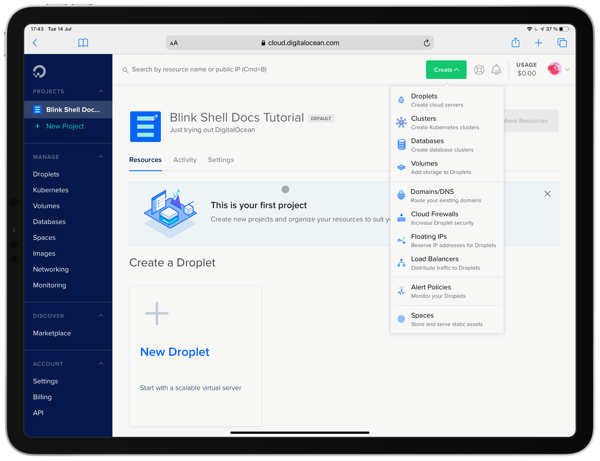

# Connecting to your Digital Ocean Droplet with Blink Shell

## Introduction

[Digital Ocean](https://www.digitalocean.com) is a prominent cloud service provider that offers an inexpensive yet performant cloud server solutions. While Amazon Web Services focuses on a wide array of smaller IT components that can work together to form a virtual infrastructure, Digital Ocean takes a more traditional approach.

Droplets are Digital Ocean's name for servers. They have fixed disk space, bandwidth and networking resources. This allows for a more straightforward onboarding experience. Unlike traditional providers, services are billed by the minute, creating a hybrid cloud solution that works well for many production configurations, including testing and development environments.

Let's take a deep dive under and see how to launch a Droplet and connect to it using Blink.

## Creating a Droplet

Sign in to your Digital Ocean account and then click *Create* at the top right corner of the page and finally pick Droplet. You can also create a Droplet from the Droplets page found on the left-hand side menu. Pick your desired Linux distribution, version and server plan. Don't worry too much about the Droplet's size as you can resize it afterwards if your needs change.




The next option to pick is the datacenter location. By selecting the closest location to you or where your final client will be you will get overall lower latencies. This helps improve the resulting user experience you're gonna deliver. Next, you're given the opportunity to select additional networking options, then you'll be prompted for credentials. You can click *New SSH key* and then add your public key so you can easily connect to your Droplet via SSH or choose password authentication. Please be aware that password authentication method is less secure.

In just a few minutes, your Droplet will become part of Digital Ocean's vas sea of servers - ready to go to work for you!

## Accessing your Droplet

Click on the *Droplets* item in the left-hand side menu to see a list of your running servers. Copy the IP address from the server and either enter it into a pre-defined host entry in Blink or use SSH on the Blink Shell to connect.

```bash
ssh root@IP_ADDRESS
```

Replacing in the previous example `IP_ADDRESS` with the IP address of your droplet.

## How to Configure your Droplet

Digital Ocean provides a wide variety of elements to customize your droplet from. Not only you can choose from several already provided distributions but you can use your custom images and explore the marketplace for Applications that suit your needs.

If you want to use Mosh, and get the most out of Blink, you can follow this [tutorial](https://www.digitalocean.com/community/tutorials/how-to-install-and-use-mosh-on-a-vps) by Digital Ocean that guides you through the process.

Under your Droplet's configuration you can start by activating IPv6 support if that's what you need, resize your CPU, disk or RAM for whatever your needs are.

As you can see there are multiple options available and prices that suit your needs that Digital Ocean's servers can help you achieve what you need.

## Conclusion

From production servers behind load balancers to test and development servers, Digital Ocean's Droplets have you covered. Pair your Droplet with Mosh and have an always-on Linux server at your command - reachable from any device from anywhere with Internet access.

In future articles, we'll explain how to set up a development environment, install VS Code remote extensions or even Jupyter Notebooks.

<div id="fyfk-widget"></div>
