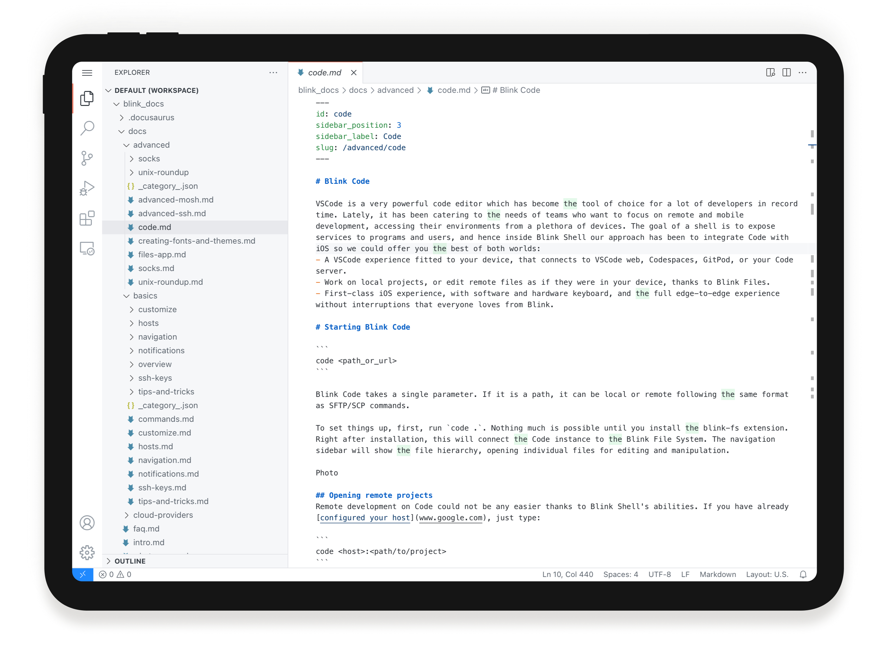
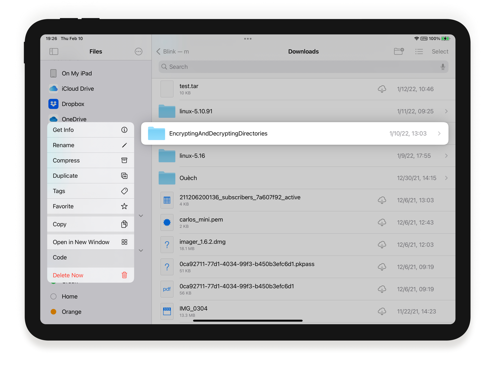
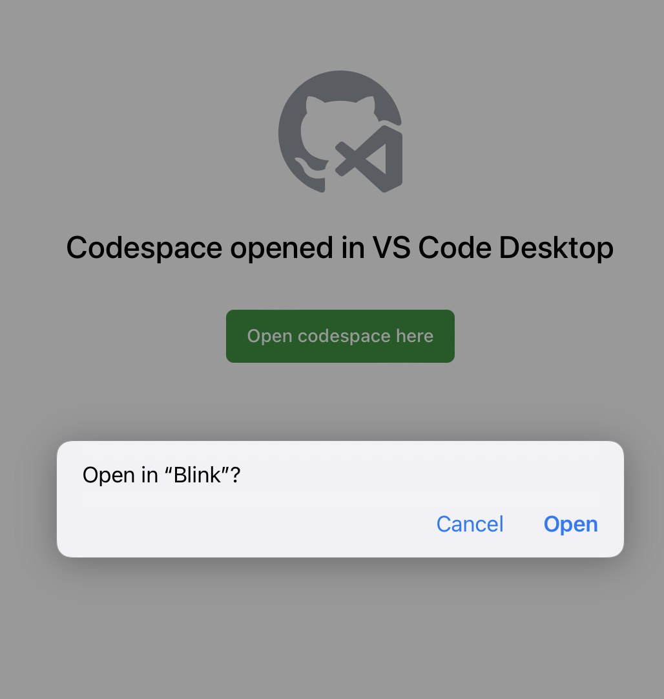

# Blink Code

VSCode is a very powerful code editor which has become the tool of choice for a lot of developers in record time. Lately, it has been catering to the needs of teams who want to focus on remote and mobile development, accessing their environments from a plethora of devices. The goal of a shell is to expose services to programs and users, and hence inside Blink Shell our approach has been to integrate Code with iOS so we could offer you the best of both worlds:
- A VSCode experience fitted to your device, that connects to VSCode web, Codespaces, GitPod, or your Code server.
- Work on local projects, or edit remote files as if they were in your device, thanks to Blink Files.
- First-class iOS experience, with software and hardware keyboard, and the full edge-to-edge experience without interruptions that everyone loves from Blink.

## Starting Blink Code

```
code <path_or_url>
```

Blink Code takes a single parameter. If it is a path, it can be local or remote following the same format as SFTP/SCP commands.

To set things up, first, run `code .`. Nothing much is possible until you install the blink-fs extension. Right after installation, this will connect the Code instance to the Blink File System. The navigation sidebar will show the file hierarchy, opening individual files for editing and manipulation.



## Opening remote projects
Remote development on Code could not be any easier thanks to Blink Shell's abilities. If you have already [configured your host](basics/hosts) and installed the blink-fs extension on the target, just type:

```
code <host>:<path/to/project>
```

Please make sure the host has all the authentication information in settings (like passwords), as to work, the connection must be non-interactive. You can check out the logs by doing `cat .blink/blinkCode.log` to identify issues.

If you have enabled [Files.app integration](advanced/files-app) for the host, there is an even easier way to launch code. Just long-press the project directory or file, and tap `Code`!



## Code in the Cloud

Blink Code can also connect to your instance of Code Server, offering the same premium experience so you can be more productive. To do so, just copy the URL of the running code instance and use it as the parameter, like such:

```
code gitpod.dev/asdfqwerzxcv
```

Note there are iOS limitations on the domains we can access (we are working on that). We currently support domains for GitHub Codespaces, GitPod, and Code-Server. If your Code instance is accessed through a private IP, we suggest you [open a tunnel](advanced/advanced-ssh#tunnels) so access happens through localhost instead.

**PRO TIP:** Blink will also capture `vscode://` routes, so it can fulfill the *Open in Desktop* functionality, for example, in GitHub Codespaces.



## Code from GitHub repositories

You can use Blink Code to quickly browse and edit your code in GitHub repositories. This is perfect when you need to do a quick fix or edit a blog or webpage, committing back changes once you are done.

On the bottom-left corner, tap the `><` button, and select "Open Remote Repository". Note you may have to log in to GitHub to access your repositories.

# Tips & Tricks

## Exploring VSCode
If you wish to explore VSCode in more depth, documentation abounds on how it works and what you can do with it. You can get started with the [VSCode official documentation](https://code.visualstudio.com/docs).

## On-Screen keyboard
Blink Code offers the same on-screen keyboard as the terminal. When you play with it, please notice that special key modifiers like `Ctrl`, `Cmd` and `Meta` are integrated inside Blink Code too. Try it opening the Command Palette using `Cmd-m`. We promise this will take your experience to the next level! 

## Keyboard Shortcuts
Blink Shell makes heavy use of keyboard shortcuts for navigation. Some of these may suppress VSCode keyboard shortcuts that you may deem necessary for your workflow. If so, you can easily reconfigure any by following [Blink Shortcuts](basics/customize#blink-shortcuts).
