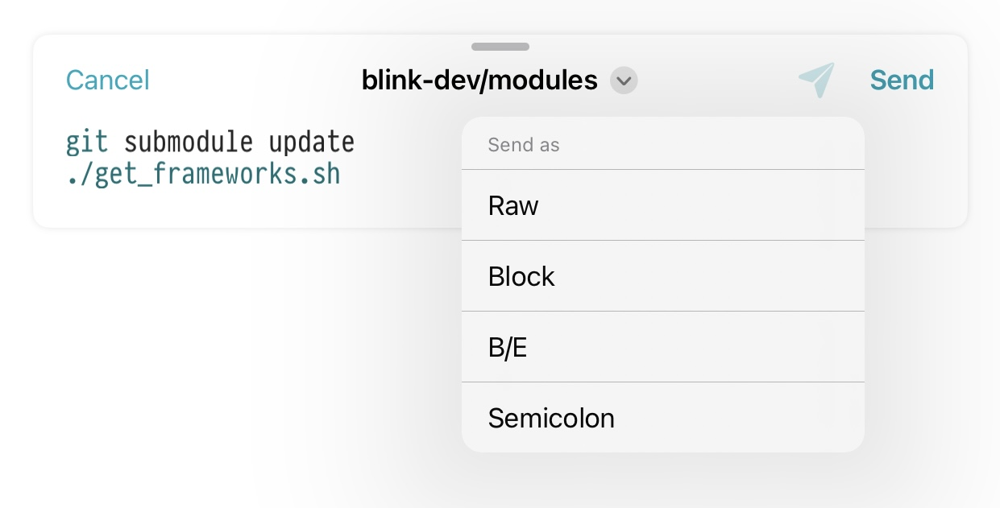

# Snips

Finding the perfect command incantation in endless internet searches? Tricky. Finding it again weeks after in your history? Frustrating. That we all suffer this for the same commands? Insane! That your whole team has to go through this endless loop? A big time waste.

Snips can act as sophisticated aliases to expedite workflows, tackle complex commands, and efficiently retrieve them later. Snips can also store important text snippets such as environment variables and secrets, so you don't have to context switch looking for them. 

Snips are simple and text-based, with no complex XML or YAML structures. This simplicity ensures they are easy and efficient to maintain and distribute on multiple platforms, enabling very cool scenarios. 

We organized snips into Indexes. Your Index is unique to you and your devices. Blink includes a default Index [maintained by the Community](https://github.com/blinksh/snippets.git) for more general dunctionality. We plan to add other Indexes focused on optimizing your usage of familiar CLI tools. And in the future, within your team, Indexes may become a way to share workflows or playbooks to get to work at speed.

As snips evolve, they will become a fundamental component of future Blink functionality. Let's dive in!

## How to use snips

To open the snips prompt, use  `CMD`+`<` or select Snips through the contextual menu (double tap `⌘` in the software keyboard or Home Bar).

Start typing `ping`, and you will see a list of snips as you type. The default Index provides common actions for Blink usage and remote servers. Select the first snip for the ping command.

Snips may contain template tags to fill out before executing. Fill this one out with *www.google.com*. Once Completed (`tab`), press Send (`CMD`+`ENTER`).

The content of a snip may span into multiple lines. When sending Command Line snips, at the moment the only supported type, Blink will concatenate the lines with a semicolon. However, you can control this behavior by pressing the ➤ symbol. Other options include: sending the content in a Raw format;  enclosing it within a Bash execution block; enclose in a Begin / End block for the Fish shell. These options provide versatility and allow you to tailor the snip behavior to suit your specific needs.

A snip name has **folder** and **action** components. Folders help organize snips in the Index; the action usually describes what will happen. You can browse all the folders inside the default Index (repo).

We designed the snips prompt to be fast and accurate when you need it. The first word will do a fuzzy search on names and quickly surface matches. For example, search for `bk` to find all the Blink-specific commands. 

Every word after that will perform a search inside the content of the displayed snips, which is useful if you are searching for a specific flag or text. For example, type `curl Content-Type`.

### Special Shortcuts

We built-in some shortcuts to speed things up and empower special scenarios:

- With an empty prompt, pressing enter will take you to Scratch Mode. Perfect for when you copy a command in a tutorial that may need some tweaking before sending.
- You can directly send to the terminal as-is from the prompt by using `CMD`+`ENTER`. Or you can copy to the clipboard by using `CMD`+`SHIFT`+`C`. These are useful if you don't need to fill out any template, like an alias.
- Similarly, from the editor, you can use `CMD`+`ENTER` to directly send the snip.
- Snips can work on Blink Code too! Useful for coding snippets you want to keep around or terminal actions.

## How to create a snip

When your search does not match any snip at the prompt, a button will automatically appear to create one.

Naming your snip is important so you can surface them quickly. We have a few [(WIP) Guidelines](https://github.com/blinksh/snippets.git) from what we learnt creating the default Index. Do not hesitate to send us your feedback.

A snip can also contain template tags to fill out using the `${tag_name}` notation. You can use the same tag name multiple times and it will be substituted in all occurrences at the same time. We have a few ([(WIP) Guidelines](https://github.com/blinksh/snippets.git) for template tags as well.

A snip may span multiple lines. Beware that at the moment, Blink only supports snips for the command line. Multiple line rules on shell scripts apply to snips. Make sure to use a `\` if you wish to create a new line that you do not wish to send separately.

After you finish, click on the `Save` button. Blink saves your snip in your Index under the specified folder and name. From then on, you can use it from the prompt.

Your local Index resides in the `Documents/snips` folder. Local snips always shadow other locations, so your local snips using the same name can customize an existing action to your liking. Ie, you can add extra flags to a command like ping.

### Editing, Renaming and Deleting snips
A snip's content can be modified and its name changed after creation. To do so, load the snip and modify the content. Press the down arrow next to the name for editing options like Save, Rename or Delete. When you save a Snip from the default Index, it will be saved in your default location, shadowing the original. If you want to have both accessible, use Rename.

