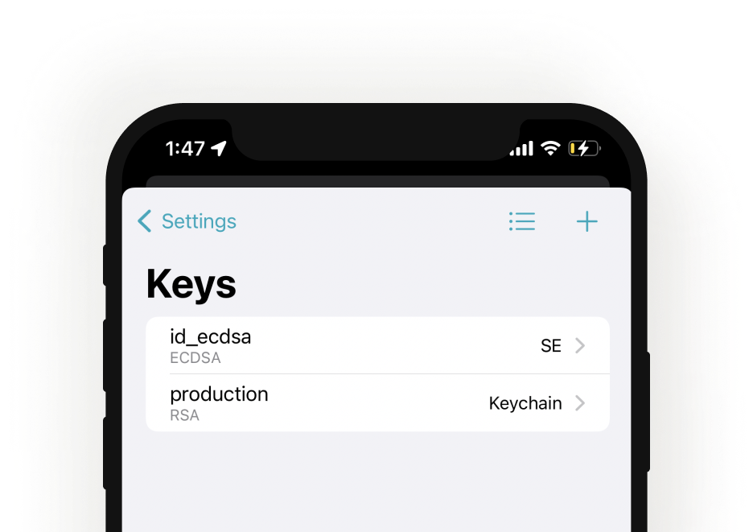
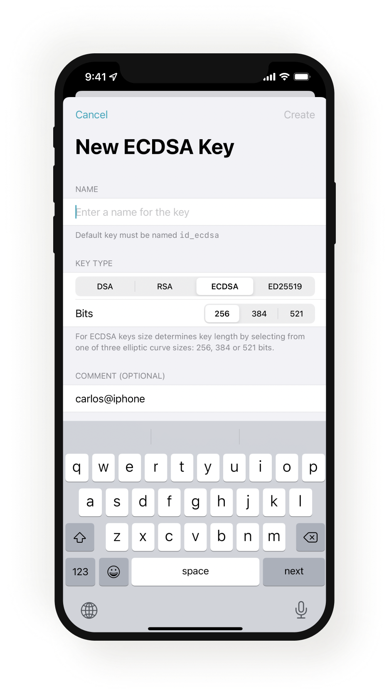

import { Callout } from 'nextra-theme-blinkshell'

# Using SSH Keys with Blink Shell for iOS

## SSH Keys

SSH Keys are small text files meant to be exchanged in lieu of passwords for verifying access to a remote server. A SSH key consists of two parts: a public and a private key. The public key is what resides on the remote server and the private key is stored on your local device. The public key is not a secret but the private key should never be shared with anyone nor uploaded to any untrusted location.

Using SSH keys is more secure than passwords as they are more difficult to crack compared to typical passwords. For example, using standard computing power it may take over a million years to crack an SSH key, but a standard password will take far less time to compromise. Additionally, SSH keys are more convenient as you don’t have to type your password in each time you want to connect to a remote server.

## Using SSH Keys in Blink

Before you can use SSH keys you must generate or import a key pair. In this article we will discuss generating a key pair. To get started, run the `config` command in Blink Shell to access the configuration pane.

Click on the `Keys` button to enter the SSH keys menu.



The default keys are always named `id_xxxx` like `id_ecdsa` or `id_ed25519`, and these will be the keys used first to authenticate. You can have multiple SSH keys to connect to multiple SSH servers. To create a key, click the `+` icon at the top and you will be presented with an Add Key Drop-Down. Go ahead with `Generate New` and the New Key dialog as shown below:



Give your key a descriptive name of your choosing. As a suggestion, if you are going to generate a specific key pair for access to a specific server, we would recommend naming the key the hostname of that server so that's easy to remember in the future.

By default, Blink Shell suggests RSA keys which have been the standard for years. Nowadays other types of keys based on other mathematical problems like elliptic curves are becoming a trend. If your server supports it, you can create an ECDSA or Ed25519 key. For RSA keys, a 2048 bit key is probably large enough, but you can even choose a 4096 bit key for extra security if you desire.

You may have noticed we do not provide the option for a passphrase anymore. Blink stores your private key on the iOS Keychain, and its contents are encrypted by the Secure Enclave itself. We think passphrases made sense when the contents of your computer could be easily read by any other apps, but that's not the case anymore. If you want extra security, you can also protect the whole Blink app through FaceID. Hence, we have deemed the extra passphrase redundant.

<Callout>
PRO TIP: What is the difference between *Generate New* and *Generate SE Key*? Secure Enclave keys or SE Keys are a special type of key with extra security properties, similar to Hardware based keys. While Blink is able to generate and store keys securely, SE Keys are generated by the Secure Enclave itself, and they cannot be extracted or read by any app or person, what prevents stealing. Keys can only be used to perform signatures by the Blink app.
</Callout>

### SSH Certificates

As an additional measure of security and control, specially in teams, Blink Shell supports adding SSH Certificates to your public key. The way SSH Certificates work is not much different than the way familiar certificates and chains of trust on the web work. Blink can import a certificate but it cannot deal with creating a Certificate Authority and signing itself. Please refer to this great article on [SSH Certificates](https://goteleport.com/blog/how-to-ssh-properly/).

## Adding a Public Key to a Remote Host

The Blink command `ssh-copy-id` command can be used to copy the public key to a remote host. This will effectively install the key for use in your connection to that server. The syntax of the command is:

```bash
ssh-copy-id identity_file user@host
```

The `identity_file` argument is the name of your SSH key pair. The `user` is the remote username, and the `host` is the remote hostname. You may also specify an IP address instead of a hostname.

## Establishing a Connection Using SSH Keys

There are two different ways to establish a connection to a remote server - via SSH or via Mosh. SSH will work in all cases, but if Mosh is available it is preferred for mobile devices or internet/network connections that may encounter high latency or frequent disconnects.

To connect via SSH:

```bash
ssh user@1.2.3.4
```

In this example, an SSH connection is established with the username user to the remote IP `1.2.3.4`. You may also specify a hostname instead of an IP address. Since no key was specified, the default key `id_rsa` will be used.

You can add pre-defined host keys in the [Hosts section](basics/hosts#Keys) of the application. 

Sometimes it is convenient to manually enforce a key to be used. In the below example, the key `your_key` is used to connect to the pre-defined host `myhost`. 

```bash
ssh -i your_key myhost
```

To connect with Mosh, the syntax is mostly the same:

```bash
mosh -I your_key host
```

In this example, `your_key` is the SSH key to use, and `host` is the host entry to use in the connection.
